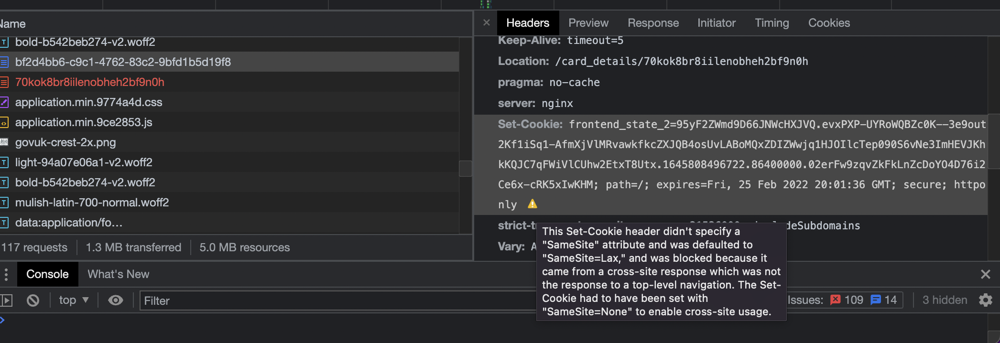
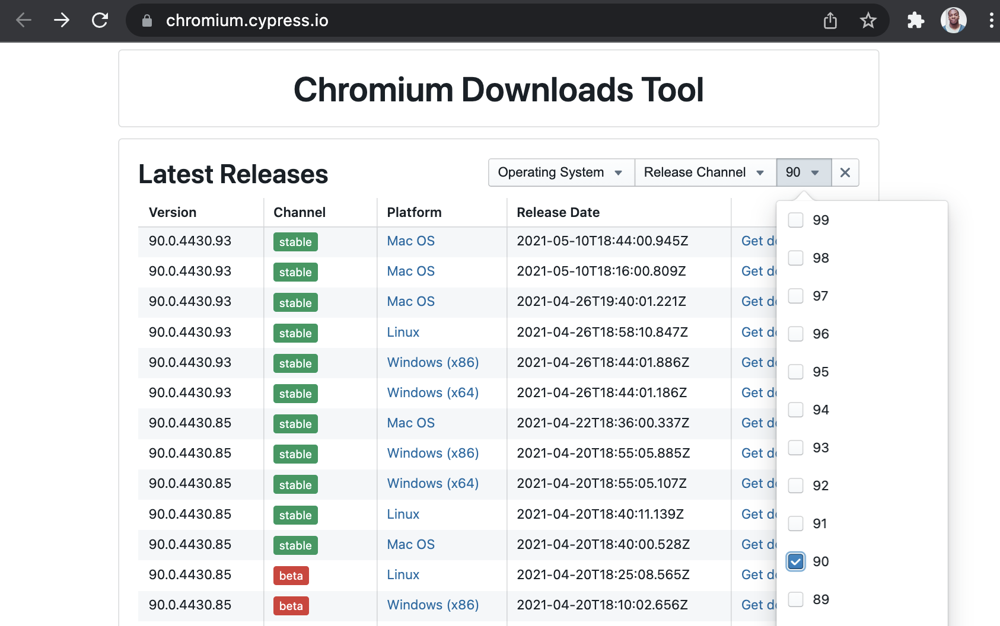
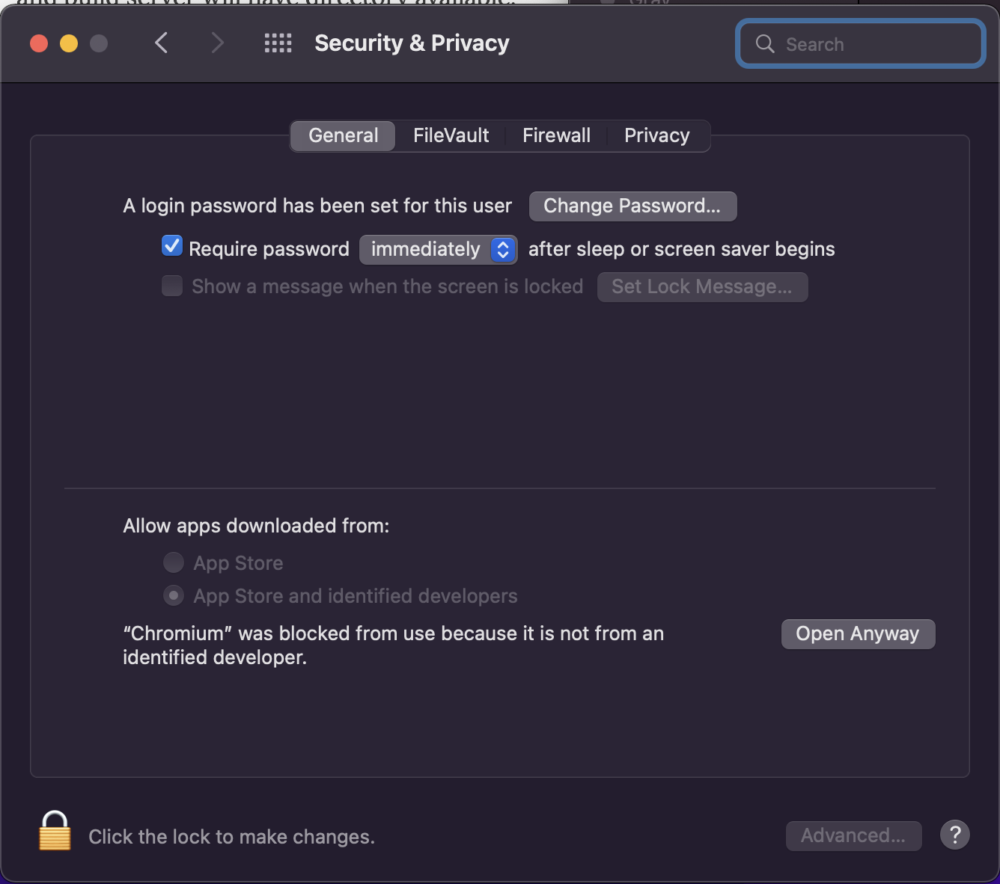
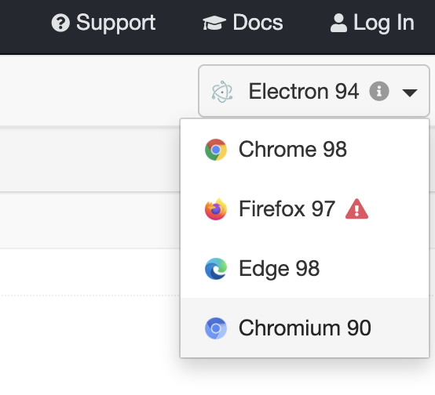

# Automated accessibility tests

This is done using [cypress](https://github.com/cypress-io/cypress), [axe](https://github.com/dequelabs/axe-core), and [cypress-axe](https://github.com/component-driven/cypress-axe)

## Prerequisite

1 - Make sure you have these values populated in the `.env` file:
```
CYPRESS_EMAIL=<your login email>
CYPRESS_PASSWORD=<your login password>
```

2 - The tests will all fail if the Cognito Login screen is not bypassed. Please make sure you have your IP whitelisted to avoid this.

3 - Don't run tests on localhost! For some reaons testing on localhost takes a long time for the page to load. THe *cypress.json* file has the demo site at the baseUrl but feel free to change that if necessary.
```json5
{
  "baseUrl": "https://www.demo.legalisation.fcodev.org.uk",
  //...
}
```
### Installing an older version of Chromium

Cypress out of the box doesn't allow you to visit different urls or domain from the base one in a given test. You can read more about that in the [Cypress documentation on web security](https://docs.cypress.io/guides/guides/web-security).

To get around that the following option can be for Chromium based browsers in the cypress.json file:

```json
{
  "chromeWebSecurity": false
}
```

This works great but for this specific test suite to work cookies also need to be stored between domains. This is something that would have been possible in older browsers but since Chrome 80 `SameSite=None` needs to be explicitly added to the API request setting the cookie for this to work.

Which means running this test suite wouldn't work on the payment step because the session cookie is not saved:



Unfortunately newer version of Chrome have also [removed the flags to disable this](https://www.chromium.org/updates/same-site/). The only way around this is to install an older version of Chromium where disabling SameSiteByDefaultCookies is possible with a flag.

It's a bit of a long process but it's needed in order to run the accessibility test suite properly.

1 - Visit the [Cypress chromium downloads site](https://chromium.cypress.io/)

2 - Find the latest stable version for 90 and download it for your relevant Operating System



_NOTE: In theory any version below Chromium 94 should work but I only tested with 90 so that's why I'm recommending it._

3 - Unzip the file and place the contents in cypress/browsers

_NOTE: The contents of this folder should be gitignored apart from the .gitkeep file. In case it isn't please do not commit the recently downloaded browser._

4 - Open the browser you just downloaded and make sure you adhere to all the security requirements of your relevant operating system.



5 - Finally navigate to cypress/plugins/index.js and change the path option in the `chromiumOptions` to match your path:
```js
    name: 'chromium',
    channel: 'stable',
    family: 'chromium',
    displayName: 'Chromium',
    version: '90.0.4430.93',
    path: --> CHANGE THIS PATH <--
    majorVersion: 90,
```

_NOTE: If you are using a version of Chromium other than 90, please change the version and majorVersion fields as well_

6 - A new browser should appear in your browser list. Please choose Chromium when running the test suite



<br/>
<br/>
<br/>


## Running the tests

After installing all the dependencies run...

1 - For development
```sh
npm run cypress
```
or

```sh
npx open cypress
```
This allows you to see what the browser is doing

2 - For CI/PROD
```sh
npm run a11y-tests
```
This runs headlessly and exports the report to the terminal as well as an xml file called **a11y-test-results.xml**
This is useful for AWS reporting but hasn't yet been configured because the tests take a while to run, even headlessly.
