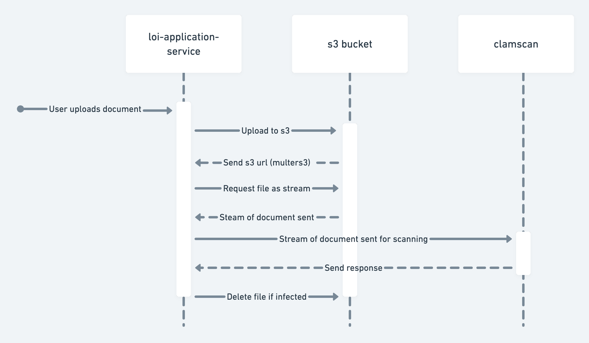

# How file upload works

The following diagram is a high level overview of how a document is uploaded to s3 and scanned for viruses using clamscan (or clamAV).

The steps will be listed below which will include a few details teh diagram misses out.

1. Document is uploaded by the user

2. Document is sent straight to s3 using multers3 but in DEV mode it is sent to the upload folder, also using multer. Multer is used instead of just the AWS SDK because of it's great support for handling `multipart/form-data`.

3. Information about the uploaded file is stored in the session (as an array of objects) which is easy to access by multiple instances of the applicaiton service on aws, (instead of storing the detials locally in the applicaiton-service).

4. Multer s3 responsed with a munch of details including the s3 location (which is the same as the url)

5. The s3 location is stored in the session in the object that belongs to the correct file.

6. The file is the retreived from s3 as a stream, which is sent to a remove instance of clamAV (hosted by Kainos) to be virus scanned

7. Locally clamAV needs to also run locally (view the docs in this folder for more info), and the absolute file path is used to upload the file for local virus scanning

8. If virus scanning passes, nothing changes

9. If virus scanning fails, as in it finds an infection, then the file is deleted from it's respective storage places and a message is sent to the user
