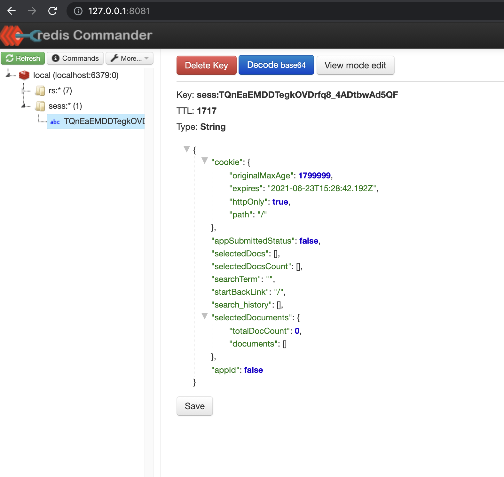

# Session data

This is handled by Redis and is used to share data between different parts of the application.



To get a visual represenation of what data is in the session:
- download and run [redis-commander](https://github.com/joeferner/redis-commander)
- click on 'More...' on the top, then 'Refersh + Expand All Nodes'
- click on the alphanumeric string under the 'sess' folder
- then click the grey 'View tree mode' button

## Modifying sesison data

Session data is a simple key value store which means it's easy to add, read, and remove data from it.

```
req.session.addDataLikeThis = 'data';
```