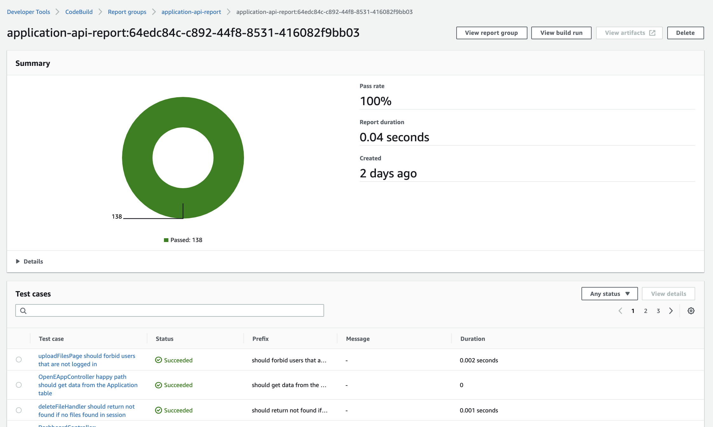

## Reporting

If the test-report script is run `npm run test-report`, this will generate a JUnit esk test report called test-results.xml which go to the root of the project. The JUnit format is one of the format that can be read by AWS hence it's usage. The reports do not need to be stored locally or on github so they are gitignored and never made public.

Their sole purpose is to report is to display what tests are passing and failing in AWS

## Continous integration

Whenever code is pushed, dependencies are installed in AWS and the tests should run. If a single test fails, the whole build fails and the code is not updated until the test is fixed. If this becomes frustrating or the tests don't get updated regularly, this check can be turned off by either deleting or commenting out the reporting and test report script steps in the buildspec file found in AWS.

## Environment variables
Environment variables are needed to life Sails before the tests can run.

When the unit tests are run locally they use the use the same environment variables file as the whole application. The .env file in the root. However, when tests are run in AWS, they use the tests/env.vars file. These instructions can be found in the buildspec file of the application service in AWS CodeBuild, if you're interested.

Whenever a new environment variable is added to the .env file in the root, if it's needed to lift Sails it sould be added to the env.vars file as well or the unit tests will not run properly in AWS.

### How do you know what variables are needed to lift Sails?

You don't. Therefore a good rule of thumb to have is to add new env vars to the env.vars file as well as the .env file in the root. This will make sure the tests will always run in AWS.

Please bear in mind the applications repository is public on GitHub, therefore any private variables **should not** be placed in the env.vars file.